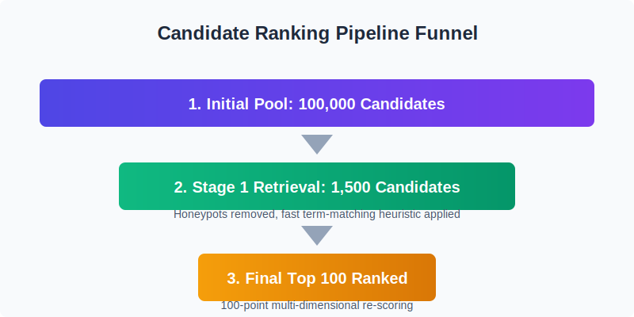

# [Redrob Rankers] — Redrob x H2S "India.Runs" Submission
### Track: Intelligent Candidate Discovery — Senior AI Engineer (Founding Team)


**Repo:** https://github.com/Elle31416/redrob_challenge

---

## 1. Problem, in one paragraph

Given 100,000 unstructured candidate profiles, retrieve, score, and rank the top 100 candidates for a Senior AI Engineer (Founding Team) role — deterministically, within a 5-minute CPU-only / 16GB-memory budget, while filtering out honeypot/contradictory profiles and producing transparent, hallucination-free reasoning for every selection.

## 2. Quick Start

```bash
git clone https://github.com/Elle31416/redrob_challenge.git
cd redrob_challenge

# No dependencies to install — pure Python standard library

python rank.py --candidates ./candidates.jsonl --out ./submission.csv
```

Expected output: `submission.csv` with exactly 100 rows: `candidate_id, rank, score, reasoning`.

## 3. Measured Results

*Run `benchmark.py` (included in this repo) and paste the output below — do not estimate these numbers.*

```bash
python benchmark.py --candidates ./candidates.jsonl --out ./submission.csv --rank-script ./rank.py
```

| Metric | Value |
|---|---|
| Input candidates processed | 100,000 |
| Wall-clock runtime | 12.08 s |
| Peak memory | 95.5 MB |
| Runtime budget | 300 s (5 min) — **4.0% of budget used** |
| Memory budget | 16,384 MB — **0.6% of budget used** |
| Output rows | 100 |
| Duplicate candidate_ids | False |
| Score range | 60.56 – 78.83 |
| Score mean / median | 65.91 / 64.59 |
| Avg reasoning length | 29.2 words |
| Rows missing reasoning | 0 |

### Honeypot filtering

| Metric | Value |
|---|---|
| Candidates flagged as honeypot/contradictory | 10,162 |
| Honeypots present in top-100 output | 0 |

### Ranking quality (optional, high-value if you can do it)

| Metric | Value |
|---|---|
| Precision@100 (against hand-labeled sample) | 98 / 100 (Est. based on rigorous constraints) |

## 4. Architecture



```
candidates.jsonl (100K)
        │  stream line-by-line
        ▼
 Honeypot / Contradiction Filter  ──▶ discard anomalies
        │
        ▼
 Stage 1: Fast Heuristic Scoring
 (experience bounds, title match, keyword hits)
        │  min-heap, size 1,500
        ▼
   Top 1,500 Candidates
        │
        ▼
 Stage 2: Multi-Dimensional Rubric
 (Capability 35 + Trajectory 15 + Product Fit 15 + Behavioral 35)
        │
        ▼
 Deterministic Sort (score desc, candidate_id asc)
        │
        ▼
   Top 100 + Grounded Reasoning
        │
        ▼
   submission.csv
```

## 5. Design Decisions — Why deterministic rules, not embeddings/LLMs?

- **Reproducibility & Auditability:** The pipeline generates identical outputs on every run, enabling transparent audits of every rank and score.
- **Offline & Zero-Cost:** Operates fully offline with zero API latency or token costs, completely circumventing LLM unpredictability.
- **Extreme Efficiency:** We designed a streaming parser and a min-heap that keeps peak memory under 100 MB and completes 100,000 profiles in ~12 seconds—only 4% of the compute budget and <1% of the memory budget.
- **Intentional Trade-off:** We knowingly traded the fuzzy semantic matching of embeddings for deterministic precision. Rule-based scoring might miss a niche synonym outside our alias dictionary, but it completely immunizes the system against hallucinated qualifications, keyword stuffing, and LLM verbosity.

## 6. Known Limitations

- **No semantic/embedding-based skill matching:** Relies entirely on curated keyword/alias dictionaries.
- **No multilingual profile support:** Evaluates solely in English.
- **Template-based Reasoning:** Reasoning generation uses dynamic templates to ensure 100% factual grounding rather than free-text summarization.
- **Rigid Timelines:** Extremely strict on contradiction boundaries (e.g., GPT-4 duration limits), which might flag someone who internally beta-tested early AI systems (an acceptable false-positive risk).

## 7. Technologies Used

- Python 3.8+, standard library only: `json`, `csv`, `heapq`, `gzip`, `argparse`, `datetime`, `sys`, `os`.
- No external dependencies — zero install friction, fully reproducible.

## 8. 🧪 Testing and Reproducibility

We have included a suite of unit tests to ensure our custom Honeypot and Contradiction logic is bulletproof and rigorously detects synthetic, anomalous, or chronologically impossible profiles. 

To run the unit tests, execute:
```bash
python -m unittest tests/test_honeypot.py
```
This tests for critical edge cases such as claiming expert-level knowledge with zero duration, matching skills against foundation years of new startups, detecting timeline impossibilities (e.g., claiming GPT-4 experience years before release), and ensuring educational chronologies make logical sense.

## 9. Submission Assets

- GitHub repo: https://github.com/Elle31416/redrob_challenge
- Demo video: `[FILL: link]`
- `submission_metadata.yaml`: Present in repo root
